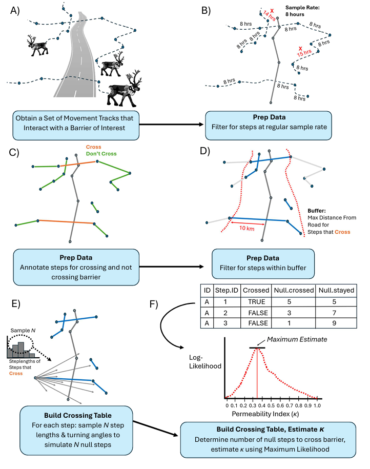

## `permeability` R package

NOTE (updated July 21, 2025): *the 'permeability" package is currently under peer review and is subject to updates in the next few months. Keep an eye out for our paper and for any updates to this repo!*

The `permeability` package uses maximum likelihood estimation with animal biotelemetry data to statistically estimate the permeability of a linear barrier of interest. Package functions take an input set of movement tracks with similar sampling rates and quantify crossings of a given linear barrier.



The central function, `fitPermeability`, uses maximum likelihood estimation to determine crossing probabilities and to generate an overall permeability score for the barrier of interest, together with confidence intervals. Values close to 0 represent a road that is impermeable and values close to 1 represent a highly permeable road to animal movement. Values greater than 1 are also possible, with a “hyper-permeable” barrier.

Additional functions can be used to a) estimate permeability of the barrier as a function of covariate(s), b) compare models, and c) summarize and visualize model results.

The vignette demonstrates use of package functions with both simulated and “real” animal movement data.

To install and load the package and vignette:

```
library(devtools)
install_github("https://github.com/barb3800/permeability", build_vignettes = TRUE)
library(permeability)
browseVignettes("permeability")
```

Report any issues or bugs to the package developers:
- Nicole Barbour, nicole.ann.barbour@gmail.com or nbarbour@towson.edu (primary contact)
- Eliezer Gurarie, egurarie@esf.edu


### Acknowledgements

*Boreal caribou tracking data was provided by the GNWT and made possible by the support of Indigenous Government Organizations and management authorities for boreal caribou, including the Sambaa K’e Dene Band, Fort Simpson Métis Local, Łı́ı́dlıı Kų́ę́ Kue First Nation, Tthets’ék’ehdélı First Nation, Pehdzeh Ki First Nation, Nahɂą Dehé Dene Band, Acho Dene Koe Band, Ka’a’gee Tu First Nation, Deninu K’ue First Nation, NWT Metis Nation, Hay River Métis Council, Fort Resolution Métis Council, K’atlodeeche First Nation, West Point First Nation, Deh Gáh Got’ıę First Nation, and Fort Providence Métis Council.*
