```{r setup, include = FALSE}
require(permeability)
knitr::opts_chunk$set(
  collapse = TRUE,
  comment = ">",
  warning = FALSE,
  message = TRUE
)
```

# Introduction: the 'permeability' package

The `permeability` package uses maximum likelihood estimation with animal biotelemetry data to statistically estimate the permeability of a linear barrier of interest. 

Package functions take an input set of movement tracks with similar sampling rates and quantify crossings of a given linear barrier (Figure 1). 

<br>

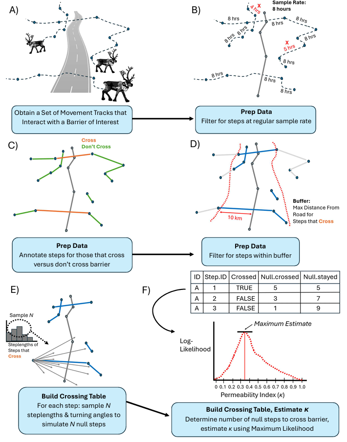{width=80% height=80%}

<br>

The central function, `fitPermeability`, uses maximum likelihood estimation to determine crossing probabilities and to generate an overall permeability score for the barrier of interest, together with confidence intervals. Values close to 0 represent a road that is impermeable and values close to 1 represent a highly permeable road to animal movement. Values greater than 1 are also possible, with a "hyper-permeable" barrier. 

Additional functions can be used to a) estimate permeability of the barrier as a function of covariate(s), b) compare models, and c) summarize and visualize model results.

This vignette demonstrates use of package functions with both simulated and "real" animal movement data. 

To load the package:

```{r package, eval = FALSE}
library(devtools)
install_github("pathprovidedonpublication", vignettes = TRUE)
library(permeability)
```


# The 'permeability' method

## Quantifying crossing probabilities

Given a set of consecutive animal locations ($Z$), “permeability” ($\kappa$) is modeled as the influence of a linear element (e.g., a road or barrier, $B$) on the animal’s redistribution kernel, aka the probability distribution of finding an animal one-time unit (or “step”) after a given observation. A barrier with a permeability of 0 results in a zero probability density on the other side, whereas a semi-permeable barrier results in a proportion of the distribution, scaled relative to the null distribution, occurring on the other side of the barrier. The amount that the redistribution kernel on the other side of the barrier is scaled relative to the null distribution can be captured with the parameter, $\kappa$, with values ranging from 0 to 1, or even > 1 in the case of a "hyper-permeable" barrier.

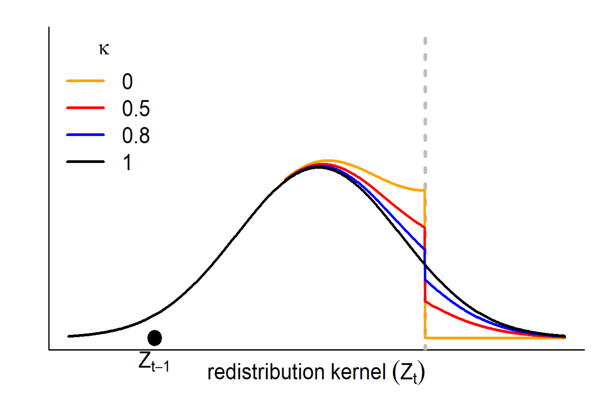{width=50% height=50%}

<br>

The probability at time *t* that an animal crosses a given barrier is given by:

$$c_t(Z_t, B, \kappa) = 1 - s_0(Z_t, B)^\kappa$$

where $s_0(\cdot) = 1 - c_0(\cdot)$ is the null probability that the animal "stays" (does not cross barrier $B$ from location $Z_t$).  This formulation has the desired properties: when $\kappa = 0$, the probability of crossing is 0, when $\kappa = 1$, the probability of crossing is the null probability $c_0 = 1-s_0$. As $\kappa$ approaches infinity, the probability of crossing approaches 1.

Thus, given a set of $k$ null steps $\vec{S_i}$ where $i \in \{1,2,...,k\}$ we take each location of interest $Z_t$, add the steps $S_i$, and simply count the number of relocations on either side of the barrier $B$.

Once this null set is obtained, the number of null locations that crossed and didn't cross the boundary can be counted ($n_{c,t}$ and $n_{s,t}$, respectively) and the estimate of the null probability of staying $s_0$ found as: 

$$\widehat{s_{0,t}} = \frac{n_{s,t}}{n_{c,t} + n_{s,t}}$$

The movement and barrier data can thus be reduced to a fundamental set of interacting observations, stored within a data frame that we define as the "*crossing table*", where each row represents a single *potential* crossing event.  At a minimum, the table contains a vector of actual crossing events $c_i = \{0,1\}$, a column of estimated null crossing probabilities $\widehat{c_{0,i}}$, and a column of estimated null "staying" probabilities $\widehat{s_{0,i}} = 1- c_{0,1}$.  The crossing table can further be annotated with any number of covariates, as detailed below. 

## Likelihood function

After obtaining the crossing table, the log-likelihood function of $\kappa$ given movement locations $Z$ and barrier $B$, is:

$${\cal L}(\kappa | Z,B) = \prod_{i=1}^n \left(I(c_i) (1 - \widehat{s_{0,i}}^\kappa) + (1 - I(c_i)) \widehat{s_{0,i}}^\kappa \right)$$

where $I(c_i)$ is the indicator function of having crossed at time *i*, i.e. the *first term* represents the rows of the crossing table (movement steps) where the animal actually crossed the barrier and the *second term* represents the movement steps where the animal did not cross the barrier.

From this, the (log)-likelihood is readily maximized to estimate $\kappa$ with approximate confidence intervals (via the Hessian of the likelihood at the maximum likelihood estimator).

## Incorporating covariates

The permeability parameter $\kappa$ can also be estimated as an exponential function of covariate(s) $X$:

$$\kappa = \exp(\beta X)$$

Covariates may represent a feature of either the barrier (e.g., a static variable, such as variable structure with different barrier segments, or a dynamic variable, such as vehicle traffic or kilometer along the highway) or the animal movement (e.g., a static variable, such as animal sex, or a dynamic variable, such as season). Multiple covariates can be included in a multivariate model formula - however, users should be cautious of parsimony, over-fitting, and sample size. When fitting categorical data, users should ensure that there is a large enough sample size of steps proximate to the barrier to estimate $\kappa$ for different category levels. 

## Null step creation

The choices made in creating null steps are important, as the distribution of step lengths sampled to create the null set of steps can impact the null probability of crossing the barrier and therefore, the estimation of $\kappa$.  

Null steps should accurately reflect crossing behavior, such that each null step has the "potential to cross". This may be best accomplished by simply sampling from an empirical distribution of step lengths for steps that cross and from a distribution of turning angles observed for any steps proximate to the barrier. 


This approach accounts for crossing-specific differences in step lengths, commonly observed for animals interacting with anthropogenic features, e.g., animals "bolting" across a road with larger step lengths to reduce risk of harm. Notably, for datasets with a low number of crossings ($< 30$), there may not be enough steps that cross to create an empirical distribution of step lengths to sample from and a simulated distribution may be required (similar to methods used for integrated Step Selection Analyses). 

# Analysis Steps and Examples

Use of the `permeability` package assumes that: 

  a) the user has familiarity with coding and working with spatial data in R (specifically, with the `sf` package) 
  
  *and* 
  
  b) has processed and cleaned their data appropriately, including a dataset of movement tracks for their taxa of interest (with some regular fix rate) and a linear barrier (as either an `sf` LINESTRING geometry type or a matrix of barrier segment locations) that the movement data interacts with.

We demonstrate usage of the package and its associated functions with both simulated and "real" movement data below.

## Simulation examples

### Null model

Using the `simulatePermeability` function, a hypothetical movement track (as a correlated random walk, with a length $N$, turning angles $\theta$, and step lengths $L$) can be simulated with an example barrier (composed of a set of linear segments), with the barrier having a pre-defined $\kappa$.

The user can mainly define: 

  * Shape and scale parameters (`step.shape`, `step.scale`) for simulated track step lengths (Weibull distribution, see `rweibull` function)
  
  * Rho or concentration parameter (`theta.rho`) for track turning angles (wrapped Cauchy distribution, see `rwrappedcauchy` function from the `circular` package)
  
  * Track length (`N.steps`)
  
  * Bounding box x and y limits for the simulation (`xmax`, `ymax`)
  
  * Number of segments in the barrier (`n.segments`)
  
  * Desired permeability of the barrier (`kappa`)
  
If the `plot.track` argument is set to TRUE, a plot of the simulated track and barrier will  be returned, with steps that crossed the barrier shown in purple and steps that "bounced" off the barrier shown in orange:

```{r simtrack1, fig.align = "center", fig.width = 6, fig.height=6, eval = FALSE}
sim_track <- simulatePermeability(xmax = 30, ymax = 30, 
                                  N.steps = 500, theta.rho = 0.5, 
                                  step.shape = 5, step.scale = 10, 
                                  n.segments = 10,
                                  kappa = 0.2,
                                  plot.track = TRUE) 
```

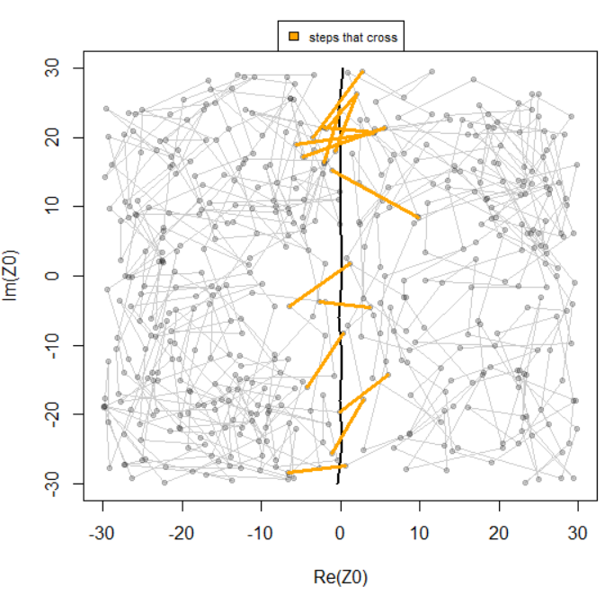

<br>

```{r loadsimdata, include= FALSE}
#save(sim_track, file = "./data/sim_example_1.rda")
load("./data/sim_example_1.rda")
```


The output of this simulation is a `permdata` list object, which contains two elements: 

 * `track` - data frame containing:
 
  - Start and end locations of each movement step (`Z.start`,`Z.end`)
  
  - Time difference between consecutive locations (`D.time`)
  
  - Simulated timestamps for each location (`Time`)
  
  - Movement step as a complex location (`Step`, see `as.complex()`)
  
  - Step length a.k.a the Euclidean distance between consecutive locations (`L`)
  
  - Absolute and turning angles for locations (`Phi` and `Theta`)
  
  - A unique identifier for each step (`Step.ID`)
  
  - Whether the step was within the maximum step length of the barrier (`In.buffer`) - only steps proximate to the barrier (where null crossings are possible) are needed to estimate $\kappa$ - for simulated data from `simulatePermeability`, all steps are retained (all simulated steps have `In.buffer==TRUE`)
  
  - Distance to barrier for the start location in each step (`Dist_toBarrier`)
  
  - Whether the step crossed the barrier or not (`Crossed`) - NA values for steps where `In.buffer==FALSE`
  
  - Simulated unique track identifier (`ID`)
  
And:

 * `barrier` - data frame containing:
 
  - Complex locations (see `as.complex()`) for the start and end of each barrier segment (`Z1`, `Z2`)
  
  - Identifier for each line (in `sf` terms, LINESTRING) in the barrier (`line_id`) - important for barriers with multiple lines (e.g., a grid-like or network-like barrier) - will be set to 1 if there is only 1 unique line
  
  - Identifier for each barrier segment (`barrier.id`)
  
  - "True" permeability $\kappa$ values (`kappa`) for each barrier segment, based on your input parameters
  
  - If a covariate model is being used, optionally `covar` values, one for each unique barrier segment (see "Covariate Model" example below)

```{r simclass}
class(sim_track)
```


```{r simstr}
str(sim_track)
```


Inmportantly, both `track` and `barrier` are in a *segmented step* format, i.e. each row represents a segment (i.e., a movement step or a barrier segment), and it is in the interaction of the movement segments and the barrier segments that the permeability is analyzed. 

```{r simtrackhead}
head(sim_track$track)
```

```{r simbarrierhead}
head(sim_track$barrier)
```


In addition to a correlated random walk (`type = "crw"` in `simulatePermeability`), users can also specify a biased correlated random walk (`type = "bcrw"`), including an argument for the `target.location` (as a matrix of X/Y coordinates) if they want to set the target location themselves (otherwise the package will simulate a random target location). 

```{r target}
target <- data.frame(X = -40, Y = 20) |>
  as.matrix()
```


```{r simtrack2, fig.align = "center", fig.width = 6, fig.height=6, eval = FALSE}
sim_track <- simulatePermeability(xmax = 50, ymax = 50, 
                                  N.steps = 100, theta.rho = 0.5, 
                                  step.shape = 5, step.scale = 10, 
                                  n.segments = 10,
                                  kappa = 0.2,
                                  type = "bcrw",
                                  target.location = target,
                                  plot.track = TRUE)
```

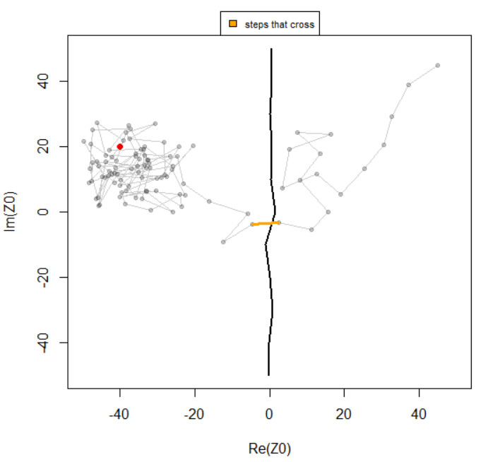

<br>

The user can also supply a simulated barrier of their own to the `simulatePermeability` function.

For example, a "grid-like" barrier could be simulated:

```{r gridbarrier}
xmax <- 50 
ymax <- 50
n.segments <- 10 

barrier_sep <- (1/2)*xmax # spacing between linear features
y <- ymax-barrier_sep # allow spacing around barrier lines

barrier1 <- cbind(X = (xmax-barrier_sep),
                  Y = y * seq(-1,1,length = n.segments+1),
                  line_id = 1)
barrier2 <- cbind(X = (xmax-barrier_sep*2),
                  Y = y * seq(-1,1,length = n.segments+1),
                  line_id = 2)
barrier3 <- cbind(X = (xmax-barrier_sep*3),
                  Y = y * seq(-1,1,length = n.segments+1),
                  line_id = 3)
```


```{r plotgridbarrier, fig.align = "center", fig.width = 6, fig.height=6, eval = FALSE}
plot(barrier1, type= "l", ylim = c(-ymax,ymax), xlim = c(-xmax,xmax))
lines(barrier2)
lines(barrier3)
```

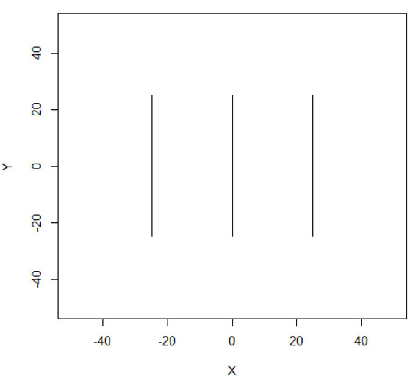
<br>

```{r headgridbarrier}
grid.barrier <- rbind(barrier1, barrier2, barrier3)

head(grid.barrier)
```

The simulated barrier can be used instead of generating a random barrier, by providing it in the `barrier` argument - `n.segments = NULL`, as `n.segments` is now equal to the number of segments present in the user-inputted barrier object.

Importantly, the `simulatePermeability` function assumes that for a barrier with multiple lines that there is a equal number of segments in each line.

```{r simtrack3, fig.align = "center", fig.width = 6, fig.height=6, eval = FALSE}
sim_track <- simulatePermeability(xmax = 50, ymax = 50, 
                              N.steps = 500, theta.rho = 0.5, 
                              step.shape = 5, step.scale = 10, 
                              kappa = 0.2,
                              barrier = grid.barrier,
                              plot.track = TRUE) 
```

```{r loadsimdata2, include= FALSE}
#save(sim_track, file = "./data/sim_example_2.rda")
load("./data/sim_example_2.rda")
```

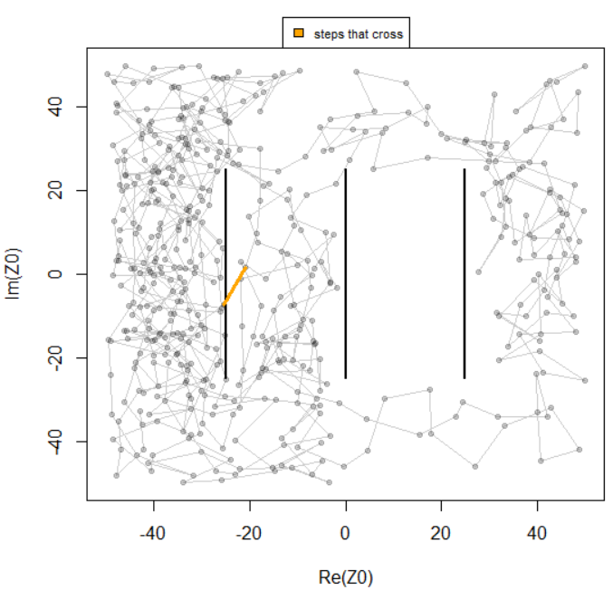
<br>

The crossing table for the simulated data can be constructed using the `buildCrossingTable` function, which takes a `permdata` object (containing simulated movement `track` and `barrier` objects) and optionally, the number of null steps to sample around each observed step (default `n.null = 60`).


```{r simct, message = FALSE, results='hide'}
sim_cT <- buildCrossingTable(permdata = sim_track)
```

The resulting object, similar to the `track` object in `permdata`, is a "step-wise" dataframe with rows for every observed step in the simulated data that had null crossings with the barrier (e.g., had the "potential to cross") and with new  columns for the:

  * Number of null steps to cross/not cross the barrier (`null.crossed`, `null.stayed`)
  
  * Number of actual steps in the data to cross the barrier (`crossed`)
  
  * Barrier id for the barrier segment where the majority of possible steps crossed (`barrier.id` - corresponds to the same `barrier.id` in `permdata`)
  
  * If the actual step crossed, the barrier segment where it crossed (`barrier.crossed`) - `barrier.crossed = NA` if the actual step did not cross the barrier

```{r simctstr}
str(sim_cT)
```

To estimate $\kappa$ using the compiled crossing table, the `fitPermeability` function can be used. 

If no equation is supplied, a null model is fit:

```{r simnullmodel, warning = FALSE}
null_model <- fitPermeability(data = sim_cT)

null_model
```

The `print`, `summary`, and `predict` functions can be used to examine the output, including the Log-Likelihood, AIC, and $\kappa$ estimate with 95% confidence interval.

```{r summarysimnullmodel}
summary(null_model)
```

```{r predictsimnullmodel}
predict(null_model)
```

To potentially get more robust estimates (with tighter standard errors), a larger sample size (e.g., 50 tracks) can be used. 

The `simulatePermeability` function has an additional argument available for `n.tracks`, with the default being 1. The function can also be run with `parallel = TRUE` (using the `future.apply` package) to speed up calculations.

```{r simtrack4, eval = FALSE}
library(future.apply)

sim_tracks <- simulatePermeability(xmax = 50, ymax = 50, 
                              N.steps = 500, theta.rho = 0.5, 
                              step.shape = 5, step.scale = 10, 
                              kappa = 0.2,
                              barrier = grid.barrier,
                              n.tracks = 50,
                              plot.track = FALSE, 
                              parallel = TRUE) 
```


### Covariate model

Permeability can also be estimated as a function of covariate(s). Covariates can be specific to the barrier (e.g., one unique covariate value per barrier segment, e.g. unique to each `barrier.id`), to the movement track (e.g., one unique covariate value for each `Step.ID`), or the interaction of the barrier and movement track (e.g., specific to crossing table rows). We demonstrate covariate values specific to the barrier here and for the movement track and interaction of the barrier and movement track in the boreal caribou "real data" examples below. 

The `simulateTrack` function will simulate covariate values for you (if no `barrier` object is specified) or, if a user-provided `barrier` object is input, will take an argument for `covars` as a vector of numeric values corresponding to the desired covariate values for each barrier segment (`barrier.id`). 

Additionally, instead of supplying a `kappa` value, we supply the coefficients defining the (log-linear) relationship between $\kappa$ and our covariate, with `beta` storing the desired intercept ($\beta_0$) and slope (e.g., $\beta_1$) values, respectively. 

The plot shows barrier segments with low covariate values in black and barrier segments with high covariate values in green:

```{r simcovar, fig.align = "center", fig.width = 6, fig.height=6, eval = FALSE}
sim_track <- simulatePermeability(xmax = 50, ymax = 50, 
                              N.steps = 500, theta.rho = 0.5, 
                              step.shape = 5, step.scale = 10, 
                              n.segments = 15,
                              beta = c(-2,1),
                              plot.track = TRUE) 
```

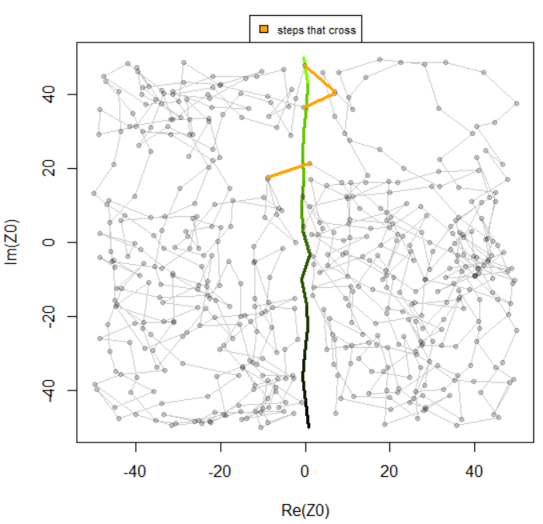
<br>

```{r loadsimdata3, include= FALSE}
#save(sim_track, file = "./data/sim_example_3.rda")
load("./data/sim_example_3.rda")
```

Note that the `barrier` object within the `permdata` output now also has additional elements for the covariate values and their associated "true" $\kappa$ values:

```{r headsimcovar}
head(sim_track$barrier[,c("covar","kappa")])
```


The crossing table is built the same as for the null model example:


```{r ctsimcovar, message = FALSE, results='hide'}
sim_cT <- buildCrossingTable(permdata = sim_track)
```

After building, the crossing table needs to be annotated with the covariate values. This allows flexibility for covariates, based on whether the covariates are associated with the barrier itself or some other non-barrier (e.g., movement step) specific covariate.

For our simulated example, we have one covariate value for each barrier segment (stored in the `barrier` object in `sim_track`), so we can use the `barrier.id` column in the crossing table to annotate our covariate values to our crossing table.

```{r processctsimcovar}
sim_cT <- merge(sim_cT, sim_track$barrier[,c("barrier.id","covar")],
                by = "barrier.id", all.x = TRUE)

str(sim_cT)
```

To estimate $\kappa$ as a function of `covar`, we supply our covariate column from our crossing table to the formula:

```{r simcovarmodel, warning = FALSE}
covar_model <- fitPermeability(~ covar, data = sim_cT)
```

The estimated coefficient values can be extracted with the `coef.table` element:

```{r coefsimcovarmodel}
covar_model$coef.table
```

Estimates may be improved by simulating multiple tracks.

The `predict` function can be used to predict $\kappa$ values for each barrier segment and unique `covar` value.

Be sure to specify `se.fit=TRUE` to get upper and lower (95%) confidence intervals on $\kappa$ estimates with the `predict` function.

```{r predictsimcovarmodel2}
predict_kappa <- predict(covar_model, se.fit = TRUE)
predict_kappa$covar <- covar_model$data$covar
predict_kappa <- predict_kappa |>
  dplyr::arrange(kappa.hat) # sort by increasing kappa values

head(predict_kappa)
```

A plot can be made of the predicted $\kappa$ values vs the covariate values for our simulated tracks, with 95% confidence intervals. 

```{r plotsimcovarmodel2, fig.align = "center", fig.width = 6, fig.height=4, eval = FALSE}
plot(predict_kappa$covar, predict_kappa$kappa.hat, type = "l",
     xlab = "Covariate Values", ylab = "Estimated Kappa Values", col ="orange", lwd = 2, ylim = c(0, 2))
lines(predict_kappa$covar, predict_kappa$ci.high, col = "grey")
lines(predict_kappa$covar, predict_kappa$ci.low, col = "grey")
```


<br>

Additionally, if the user wishes to supply their own barrier with covariate values for each segment, this can be done with the `covar` argument.

```{r datasimcovar2, eval = FALSE}
n.segments <- 10
barrier <- cbind(X = xmax * rnorm(n.segments+1, sd = xmax / 5e3),
                     Y = ymax * seq(-1,1,length = n.segments+1),
                     line_id = 1)
covar_values <- sort(runif(n.segments, 1, 5))
```


```{r simcovar2, eval = FALSE}
sim_tracks <- simulatePermeability(xmax = 50, ymax = 50, 
                              N.steps = 1000, theta.rho = 0.5, 
                              step.shape = 5, step.scale = 10, 
                              barrier = barrier,
                              covar = covar_values,
                              beta = c(-2,1),
                              plot.track = FALSE) 
```


## Boreal caribou examples

Boreal caribou (*Rangifer tarandus*) are non-migratory caribou inhabiting boreal forests in Canada, including areas proximate to human development and major road highways in the Northwest Territories (NWT).

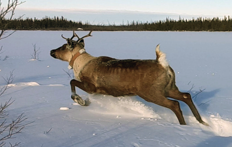{width=70% height=70%}

<br>


In the Northwest Territories, boreal caribou are known to utilize habitat proximate to major highways such as Highway 1 (Figure 3) but may avoid crossing when vehicle traffic is high. 

<br>


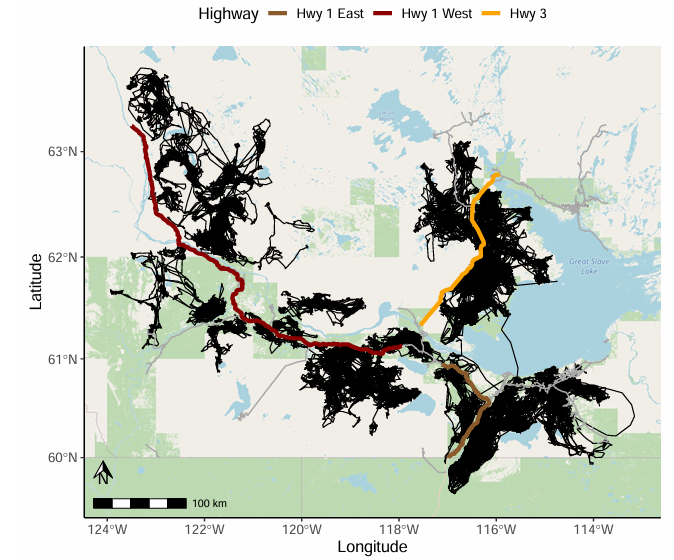

<br>


This example will use GPS tracking data from 10 boreal caribou that encounter Highway 1 West, one of the major NWT highways. 

Example data, including a dataframe of caribou locations, Highway 1 West `sf` object, and daily traffic volume data for Highway 1 West can be loaded using the `data` function.

```{r bordata}
data("boreal_caribou")
data("hwy1_west")
data("traffic_data")
```

### Prep data

The `permeability` package requires movement data to have columns for:

  * ID (`factor` or `character` structure)
  
  * Time (`POSIXct`, date and time)
  
  * X and Y spatial coordinates (`X` and `Y`, units in meters)
  
  * Any covariate(s) specific to movement steps (can be numeric or categorical - here, `traffic_volume` and `Season`)


```{r strbordata}
str(boreal_caribou)
```

For this example, we will focus on caribou interactions with the western portion of Highway 1. 

Barrier data can either be a spatial LINESTRING object (class `sf`) or a matrix of X and Y coordinates. It should have the same coordinate reference system as the movement data.

```{r strbarrier}
str(hwy1_west)
```

X and Y coordinates can be extracted from the `sf` object and converted to a matrix using the `st_coordinates` function. 

```{r headbarrier}
hwy1_west_xy <- st_coordinates(hwy1_west)
head(hwy1_west_xy)
```

The output includes a third column `L1` for the id of the line. If the barrier object has multiple lines (e.g., a grid or network format), this column is especially useful for keeping track of distinct geometric lines. However, note that even features that appear to be one line are often made of multiple lines:

```{r checkuniquelines}
unique(hwy1_west_xy[,"L1"])
```

If barrier data is being provided as a non-`sf` object (matrix of barrier segments), `permeability` functions require the barrier data to contain `X` and `Y` coordinates and the third column to be named `line_id`, even if there is only 1 line in the object.

Alternatively, users can simply provide their barrier data as an `sf` LINESTRING object to `permeability` functions.

```{r colnamesbarrier}
colnames(hwy1_west_xy) <- c("X","Y","line_id")
```

Users can also annotate these coordinates with covariate values specific to each segment (see simulation examples above). Just keep in mind that for each line in your barrier coordinates matrix (e.g., each unique `line_id`), there are $n$ rows but $1 - n$ segments. 

Additionally, if your LINESTRING object is continuous in space but made of multiple lines (e.g., the `hwy1_west` example here, which has 29 lines within a continuous feature), you will need to account for the fact that the end of each line has the same spatial point as the beginning of the next line (resulting in duplicates, unless you remove them).

```{r checkxyduplicates}
hwy1_west_xy[566:573,]
```
Examples are shown for this with the covariate model examples below.


It's helpful to check using a basic plot of the barrier coordinates (as complex locations, see `as.complex`) that the barrier spatial object looks as it should (occasionally, imported shapefiles from ArcGIS can have unordered segments). 

Note that if you have multiple lines in your barrier (e.g., multiple unique `line_id` values), each line should be plotted separately to ensure correct ordering of segments.

```{r plotbarrier, fig.align = "center", fig.width = 7, fig.height=6, eval = FALSE}
z <- hwy1_west_xy[,1] + 1i*hwy1_west_xy[,2]
plot(z, type = "l")
```

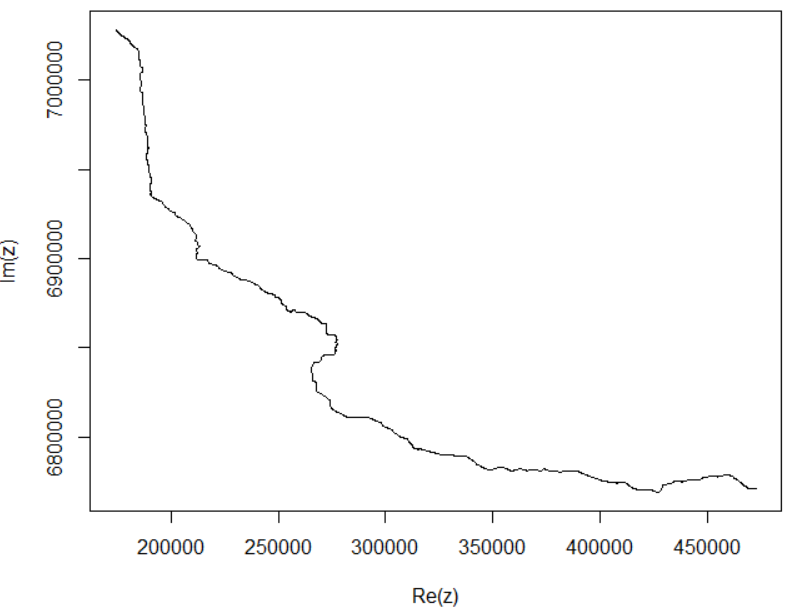

<br>

The `permeability` package requires that movement data have a (mostly) regular fix rate. The fix rate should be checked prior to utilizing `permeability` functions. 

```{r timesteps, eval = FALSE}
time_steps <- boreal_caribou |> 
  group_by(ID) |>
  arrange(Time) |>
  mutate(dT = c(NA, as.numeric(round(difftime(Time[-1], Time[-length(Time)], units = "hours"))))) |>
  ungroup() |>
  data.frame() |>
  select(dT)
```

```{r plottimesteps, fig.align = "center", fig.width = 6, fig.height=4, eval = FALSE}
barplot(table(time_steps))
```


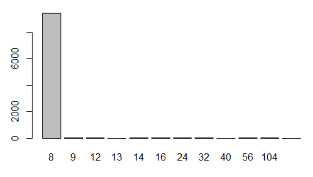

<br>

The example data is primarily composed of fixes every 8 hours.

Some irregularity is tolerable, since steps not equal to the fix rate (with a tolerance that can be specified with `sample.rate.tolerance` in the `prepPermeability`mfunction - default 1 hour) will simply not be used in permeability functions - this ensures that the user does not need to use interpolation (which may result in "fake" regular locations). 

The user should ensure that their data is clean (processed to remove any tag errors or other erroneous locations) and mostly regular. We recommend the `resample` function from the `amt` package to aggregate any steps with short fix rates less than the desired `sample.rate`.

Note that if there are *many* irregular timesteps or large gaps between locations in your data, the user should regularize their data before using the `permeability` package functions, as otherwise there will not be enough movement steps to estimate $\kappa$.

After the tracking data has been cleaned, the `prepPermeability` function is used to further format movement data for `permeability` package functions, creating a `permdata` object similar to the simulation examples. 

Main arguments to set in this function are the `sample.rate` (and optionally, `sample.rate.tolerance`, which defaults to 1 hour around the sample rate) and optionally, the buffer around the barrier (`buffer.m`). If `buffer.m = NULL` (the default), `prepPermeability` will set the buffer to the maximum distance from the barrier observed for steps that cross. The user can also supply their own `buffer.m`, but should only do so if this distance justifiably will include all steps with the "potential to cross" the barrier (all steps not in the buffer will not be used to build the crossing table).

Setting `plot.track=TRUE` will also optionally output a plot of each track, including the barrier in red if it's proximate. As example for one individual:

```{r prepbor1, fig.align = "center", fig.width = 6, fig.height=5, eval = FALSE}
bor_format <- prepPermeability(move.df = subset(boreal_caribou, ID == "ID_3"),
                         barrier = hwy1_west_xy,
                         sample.rate = 8,
                         plot.track = TRUE)
```

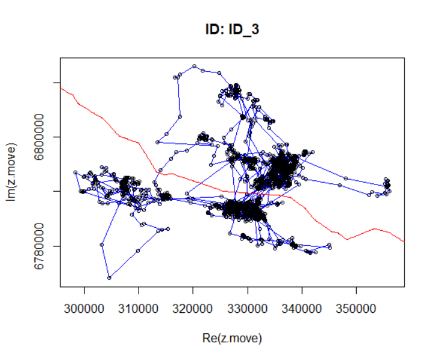

<br>

Covariates can also be annotated to the `permdata` object. Covariates specific to animal movement steps can be provided with the `move.covar.names` and `move.covar.values` arguments. Barrier segment specific covariates can be specified using the `barrier.covar.values` argument, which should contain a dataframe of covariate values for every barrier segment (e.g., rows correspond to each barrier segment or each unique `barrier.id`, AFTER accounting for unique lines, e.g., any duplicate segments).  

For movement step specific covariates, the `prepPermeability` function takes a vector with the name(s) of the covariate column(s) in the input movement data (`move.covar.names`), as well as an argument for how to annotate steps with covariate data (`move.covar.values`, options being to use covariate values from the `start` location in the movement step, the `end` location in the step, or for numeric covariates, optionally the `mean` or `difference` of the start and end location covariate values - defaults `start`).

For our example boreal caribou data, locations have been annotated with 5 seasons (pre-calving Apr, calving May - June, summer Jul - Aug, fall Sep - Nov, and winter Dec - Apr), a movement-step specific covariate. 

We also create a barrier-specific covariate, `km`, representing kilometer markers for every barrier segment along the highway, from the complex locations derived from the barrier X/Y coordinate data and accounting for unique lines.

```{r barriercovariate, eval = FALSE}
z <- hwy1_west_xy[,1] + 1i*hwy1_west_xy[,2]

barrier_covar <- cbind(hwy1_west_xy, z) |> 
  data.frame() |>
  group_by(line_id) |>
  reframe(km = Mod(diff(z))) |>
  select(km) |>
  mutate(km = cumsum(km)/1000) |>
  data.frame()
```


To speed up run time, this function can also be run in parallel, using the`future.apply` package and `parallel = TRUE`):

```{r prepborcovar, eval = FALSE}
bor_format <- prepPermeability(move.df = boreal_caribou,
                         move.covar.names = c("Season"),
                         barrier.covar.values = barrier_covar,
                         barrier = hwy1_west,
                         sample.rate = 8)
```

```{r saveborformatcovar, include = FALSE}
#save(bor_format, file="./vignettes/data/bor_format.rda")
load(file="./data/bor_format.rda")
```

The output `permdata` object is a list with dataframes `track` and `barrier`.

```{r classprepbor2}
class(bor_format)
```


`track` contains the movement data, with rows for every step and including columns for:

  * Start and end locations of the step (`Z.start`, `Z.end`, as complex locations, see `?as.complex()`)
  
  * Time length of the step (in hours, `D.time`)
  
  * Date/time for the first location in the step (`Time`, POSIXct format)
  
  * Various movement metrics (step length `L` in meters, absolute and turning angles in radians, `Phi` and `Theta`)
  
  * Whether the step was within the buffer of the barrier (`In.buffer`)
  
  * Unique identifier for the step in each individual track (`Step.ID`)
  
  * Whether the step crossed the barrier (`Crossed`)
  
  * Any step-specific covariate values (`Season`)
  
```{r strprepbor2track}
str(bor_format$track)
```
  
  
`barrier` contains the barrier data, with rows for every segment and including columns for:

  * Complex locations (see `as.complex()`) for the start and end of each barrier segment (`Z1`, `Z2`)
  
  * Identifier for the each barrier segment (`barrier.id`)
  
  * Identifier for each line (in `sf` terms, LINESTRING) in the barrier (`line_id`) - will be set to 1 if there is only 1 unique line
  
  * Any barrier-specific covariate values (`km`) 
  
```{r strprepbor2barrier}
str(bor_format$barrier)
```
  

The `print` or `summary` functions can also be used to get a quick summary of the `permdata` object, including the final buffer size (`Buffer.dist.m`), number of ID's with locations in the buffer (`N.IDs.in.Buffer`), sample rate and date range of the data (`Sample.rate.hrs`, `Date.range`), number of total steps in the buffer (`N.steps.in.buffer`), the number of steps that crossed the barrier (`N.steps.to.Cross`), and the mean steplength for steps that crossed the barrier (`Mean.crossing.steplength.m`). 

```{r}
summary(bor_format)
```

### Build crossing table

Null steps for each actual, observed movement step are simulated by sampling observed step lengths and angles from the data. 

The `buildCrossingTable` function will default to creating null steps by:

  1) sampling step lengths for all steps that cross the barrier
  
  2) sampling all turning angles for steps within the defined buffer distance of the barrier, using `n.null` as the sample size 
  
  Notably, if there are < 30 steps that cross the barrier, a Weibull distribution will be fit to the steps that cross, using the mean crossing steplength as a starting scale value (with the `fitdistr` function from the `MASS` package); the `rweibull` function will then be used to sample `n.null` number of steplengths from this distribution. 

Users can also optionally provide their own vectors of step lengths and angles (with the arguments: `step.lengths`, `turning.angles`, `absolute.angles`) to generate null steps. Users should ensure that these accurately represent steps with the "potential to cross" a given barrier, however, as `fitPermeability` is sensitive to the null distribution. 

The crossing table can be created for all individuals at once using the `buildCrossingTable` function. 

Main input arguments are the:

  * `permdata` list object with `track` and `barrier` dataframes (output from the `prepPermeability` function)
  
  * Number of null steps to be simulated for each actual step (`n.null`, default 60)
  
Note that this function works by determining all the stepwise crossings for each animal movement step and barrier segment within the buffer and at the desired sample rate, so for large datasets, this function can take 10+ minutes to run. 

```{r ctbor, eval = FALSE}
bor_cT <- buildCrossingTable(permdata = bor_format)
```

```{r savectbor, include = FALSE}
#save(bor_cT, file = "./vignettes/data/bor_cT.rda")

load("./data/bor_cT.rda")
```

For very large datasets, running in parallel is recommended to significantly improve processing time. This option uses the `future.apply` package.

```{r parallelpackage, eval = FALSE}
require(future.apply)
```

```{r parallelct, eval = FALSE}
bor_cT <- buildCrossingTable(permdata = bor_format,
                             parallel = TRUE)
```


The resulting crossing table, similar to the `track` object in `permdata` as output from `prepPermeability`, has rows for every movement step with null crossings (e.g., includes every step that had the "potential to cross") and additional columns for:
  
  * `barrier.id` (barrier segment where the majority of null steps crossed)
  
  * `null.crossed` and `null.stayed` (number of null steps to cross versus not cross the barrier)
  
  * `crossed` (1 if the actual step crossed, 0 if not)
  
  * `barrier.crossed` (barrier segment where the actual step crossed - NA if it did not)
  

```{r strborct}
str(bor_cT)
```

### Annotate crossing table

In order to fit `permeability` models with covariate(s), the crossing table needs to be annotated with any of these variables. 

The crossing table has rows corresponding to the interaction of each movement step (identified with `Step.ID`) and each barrier segment (identified with `barrier.id`). It additionally contains a `Time` column (in POSIXct format) that contains the timestamp for the first location in the movement step, which can be used to match with time-varying covariates.

For the caribou data, covariates of interest include season (categorical), traffic volume (numeric), day of year (numeric), and kilometers along the highway (numeric).

Season can be added to the crossing table by simply merging the crossing table with its `permdata` object, using the matching `ID` and `Step.ID` columns.

```{r mergepermdata, eval = FALSE}
track_covar <- bor_format$track[,c("ID", "Step.ID","Season")]

bor_cT <- merge(bor_cT, track_covar, by=c("ID", "Step.ID"), 
                    all.x=TRUE)
```

Kilometer markers along the highway is also available in the `permdata` object, specifically in the `barrier` dataframe (`km`). It can be added to the crossing table using the matching `barrier.id` values.

```{r mergepermdata2, eval = FALSE}
barrier_covar <- bor_format$barrier[,c("barrier.id", "km")]

bor_cT <- merge(bor_cT, barrier_covar, by=c("barrier.id"), 
                     all.x=TRUE)
```


Traffic volume is contained in a separate dataframe, with daily traffic volumes recorded for each unique date. `Date` can be extracted the from the `Time` column in the crossing table and used to merge with the traffic data matching `Date` column.

```{r annotatetraffic, eval = FALSE}
bor_cT$Date <- as.Date(bor_cT$Time)

bor_cT <- merge(bor_cT, traffic_data, by = "Date", all.x = TRUE) |>
  unique()
```


Finally, day of year can be extracted using the `lubridate` package and its `yday` function on the `Time` column in the crossing table.

```{r annotatedoy, eval = FALSE}
bor_cT$doy <- lubridate::yday(bor_cT$Date)
```


```{r loadfinalct, include=FALSE}
#save(bor_cT, file = "./data/final_borct.rda")
load("./data/final_borct.rda")
```

```{r finalct}
str(bor_cT)
```

### Plot crossings

The `plotCrossings` function can be used with the `permdata` object to visualize crossings, with the default being a base R plot for all individuals. Setting `individual.plots=TRUE` will output plots for tracks individually.

```{r plotcrossingsbasic, fig.align = "center", fig.width = 6, fig.height=6, eval = FALSE}
plotCrossings(permdata = bor_format)
```

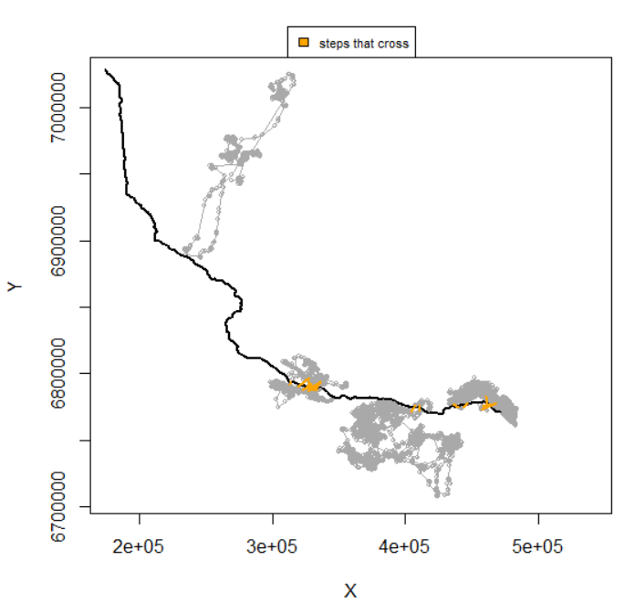

<br>

More advanced options for `plotCrossings` include an interactive map (`interactive.map=TRUE`, using the `mapview` package) or a static map (`static.map=TRUE`, `ggplot2` package, with the option to include a basemap with `add.basemap=TRUE` using the `ggspatial` package). Static maps can be easily exported as images. 

```{r mappingpackages, eval = TRUE}
library(mapview)
```

Importantly, to use the interactive and static options for `plotCrossings`, the user also needs to provide the original data and the `sf` version of the barrier, for spatial mapping.

```{r plotcrossings, fig.align = "center", fig.width = 6, fig.height=6, eval = TRUE}
plotCrossings(permdata = bor_format, 
              original.data = boreal_caribou,
              barrier.sf = hwy1_west,
              interactive.map = TRUE)
```


```{r plotcrossings2, fig.align = "center", fig.width = 8, fig.height=6, eval = FALSE}
crossing_map <- plotCrossings(permdata = bor_format, 
                              original_data = boreal_caribou,
                              barrier.sf = hwy1_west,
                              static.map = TRUE,
                              add.basemap = TRUE)

crossing_map
```

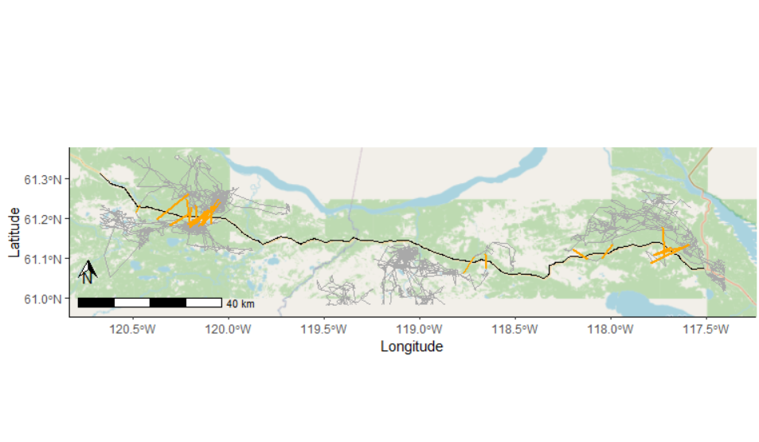

<br>

### Null model

```{r loadmodels, echo = FALSE}
#save(null_model, traffic_model, season_model, additive_model, interactive_model, spline_doy_model, spline_km_model, doy_traffic_model, file = "./data/boreal_models.rda")

load("./data/boreal_models.rda")
```


The null model can be fit to the crossing table data to estimate $\kappa$ for the barrier of interest, similar to the simulation example.


```{r bornullmodel, eval = FALSE}
null_model <- fitPermeability(data = bor_cT)
null_model
```

```{r bornullmodel2, echo = FALSE}
print(null_model)
```


### Covariate models

Covariate models can include additive and/or interactive fixed effects and/or optionally, a splined covariate.

First, a model with traffic volume:


```{r borcovarmodel, eval = FALSE}
traffic_model <- fitPermeability(~ traffic_volume, data = bor_cT)
traffic_model
```

```{r borcovarmodel2, echo = FALSE}
print(traffic_model)
```

Second, a model with season as a categorical variable:

```{r borcovarmodel3, eval = FALSE}
season_model <- fitPermeability(~ Season, data = bor_cT)
season_model
```

```{r borcovarmodel4, echo = FALSE}
print(season_model)
```

Models with interactive and additive effects of season can then be specified:

```{r boradditive, eval = FALSE}
additive_model <- fitPermeability(~ Season + traffic_volume, data = bor_cT)
additive_model
```

```{r boradditive2, echo = FALSE}
print(additive_model)
```

```{r borinteractive, eval = FALSE}
interactive_model <- fitPermeability(~ Season*traffic_volume, data = bor_cT)
interactive_model
```

```{r borinteractive2, echo = FALSE}
print(interactive_model)
```

Models with a spline of a continuous numeric covariate can also be specified, e.g., day of year or kilometers along the highway. The `fitPermeability` function uses a wrapper function with `mgcv` functions for fitting smoothers and has support for `mgcv` arguments (e.g., number of knots, smoother type, etc), using the `s` function.

Here, we specify number of knots (`k`) of 4 and cyclic cubic regression spline type (`bs = "cc"`) for day of year as a covariate.

```{r splinedoy, eval = FALSE}
spline_doy_model <- fitPermeability(~ s(doy, k = 4, bs = "cc"), data = bor_cT)
spline_doy_model
```

```{r splinedoy2, echo = FALSE}
print(spline_doy_model)
```

Results include the number of spline parameters (`k`, also the number of basis functions) and results of a Likelihood Ratio Test (including test statistic and p-value) comparing the model with the splined covariate to a model without it (in this case, just a null model of permeability). A p-value < 0.05 indicates that the model with the splined covariate is significantly improved over one without it.

Spatial variability in permeability along a highway can be determined using a splined covariate of kilometers along the highway:

```{r splinekm, eval = FALSE}
spline_km_model <- fitPermeability(~ s(km, k = 6, bs = "cs"), data = bor_cT)
spline_km_model
```


```{r splinekm2, echo = FALSE}
print(spline_km_model)
```


Additive effects can also be used with a splined covariate:

```{r borsplinecovar, eval = FALSE}
doy_traffic_model <- fitPermeability(~ traffic_volume + s(doy, k = 4, bs = "cc"), 
                                        data = bor_cT)
doy_traffic_model
```

```{r borsplinecovar2, echo = FALSE}
print(doy_traffic_model)
```


### Model Comparison

Models can be easily compared using the `comparePermFits` function from `permeability`, which easily extracts and sorts AIC values for a set of candidate models.

Users can either provide a list of formulas or model objects (as output from `fitPermeability`) to the function.

```{r modelcomparison, eval = FALSE}
bor_models <- list(Null = null_model,
                   Traffic = traffic_model, 
                   Season = season_model,
                   SeasonandTraffic = additive_model,
                   SeasonxTraffic = interactive_model,
                   SplineDoy = spline_doy_model, 
                   SplineKm = spline_km_model,
                   SplineDoyandTraffic = doy_traffic_model)
compare_models <- comparePermFits(models = bor_models)
```

Or:

```{r modelcomparison2, eval = FALSE}
bor_formulas <- list(Null = ~1,
                     Traffic = ~traffic_volume, 
                     Season = ~Season,
                     SeasonandTraffic = ~Season + traffic_volume,
                     SeasonxTraffic = ~Season*traffic_volume,
                     SplineDoy = ~ s(doy, k = 4, bs = "cc"), 
                     SplineKm = ~ s(km, k = 6, bs = "cs"),
                     SplineDoyandTraffic = ~ traffic_volume + s(doy, k = 4, bs = "cc"))

compare_models <- comparePermFits(bor_formulas, data = bor_cT)
compare_models
```

```{r loadmodelcomparison, echo = FALSE}
#save(compare_models, file = "./data/compare_models.rda")
load("./data/compare_models.rda")
compare_models
```


The output includes the number of parameters (`k`), log Likelihood, AIC, and delta AIC (`dAIC`) values for each model, ordered by lowest AIC to highest. 

Here, there is less than 1 AIC unit difference between a null model of permeability, a model with a spline of km along the highway, and a model with traffic volume as a covariate, suggesting that the spline of km model, despite having the lowest AIC, is not significantly improved over the other two possible models. 

### Model Predictions

The `predict` function (with `se.fit = TRUE` for 95% confidence intervals) can be used with either new or existing data to get predicted $\kappa$ values as a function of covariates.

We will make predictions for the top-ranking covariate model, with `traffic_volume`.

```{r predictborcovarmodel, eval = FALSE}
predict_kappa <- data.frame(traffic_volume = traffic_model$data$traffic_volume)
prediction <- predict(traffic_model, se.fit = TRUE)
predict_kappa <- cbind(predict_kappa, prediction)
```

The user can also provide new data with a range of possible covariate values to predict on:

```{r predictborcovarmodel2, eval = FALSE}
predict_kappa <- data.frame(traffic_volume = 
                         seq(0, 100, by = 1))
prediction <- predict(traffic_model, new.data = predict_kappa, se.fit = TRUE)
predict_kappa <- cbind(predict_kappa, prediction)
```

Predictions (with 95% confidence intervals) can be plotted to visualize the relationship between $\kappa$ and the covariate (daily traffic volume):

```{r plotborcovarmodel, fig.align = "center", fig.width = 6, fig.height=4, eval = FALSE}
plot(predict_kappa$traffic_volume, predict_kappa$kappa.hat, type = "l", 
     xlab = "Daily Traffic Volume", 
     ylab = "Estimated Kappa Values", 
     col ="orange", lwd = 2, ylim = c(0, 0.15))
lines(predict_kappa$traffic_volume, predict_kappa$ci.high, col = "grey")
lines(predict_kappa$traffic_volume, predict_kappa$ci.low, col = "grey")
```

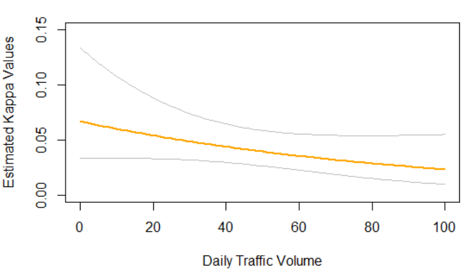

<br>

The `permeability` package also supports boostrapping to get standard errors on estimates, in the case of the Hessian being unable to get standard errors. The `fitPermeability` and `predict` functions will give warnings if standard errors are unable to be estimated with the Hessian and will suggest that users use `bootstrap = TRUE` with the `predict` function to get standard errors and confidence intervals on estimates. 

```{r bootstrap, eval = FALSE}
prediction <- predict(traffic_model, se.fit = TRUE, bootstrap = TRUE)
```

Bootstrapping can take awhile, so it's also suggested that users run the `predict` function with `parallel = TRUE` (using the `future.apply` package) to speed up run time.

```{r bootstrapparallel, eval = FALSE}
prediction <- predict(traffic_model, se.fit = TRUE, bootstrap = TRUE, parallel = TRUE)
```

### Map Predictions

Predictions from fitted models can also be mapped to `sf` barrier segments, using the `mapPredictions` function.

This function takes a dataframe of predictions, including a `barrier.id` value for each value so that it can be mapped to barrier segments, and the original `sf` barrier object used as input to the `prepPermeability` function.

The function can also handle multiple linear features; for example, if you had three highways of interest occurring in the same spatial area, you could bind them together into one large `sf` object, including a column `Feature.ID` to distinguish them. The `predictions` dataframe should also have a column called `Feature.ID`, to map individual linear feature predictions to their own geometry.

Finally, this function has options for creating a static map without a basemap (default), with a basemap (using `ggspatial` if `maptype` is specified or `basemaps` with an ESRI landscape map, by default), or to create an interactive map (with `mapview` and `interactive = TRUE`). Users can optionally add an `sf` POINT object of their movement data to map movement tracks with the barrier(s) (using the `tracks.sf` argument) or even add their own basemap (provided to the `basemap` argument).

Here, we show an example predicting $\kappa$ values as a function of `km` along the highway, using the fitted `spline_km_model` from above. First, a `predictions` dataframe is created, storing `km` and corresponding `barrier.id` values for each barrier segment.

```{r dfpredictions, eval = FALSE}
hwy1_west_z <- hwy1_west_xy[,1] + 1i*hwy1_west_xy[,2]
predictions <- cbind(hwy1_west_xy, hwy1_west_z) |> 
  data.frame() |>
  group_by(line_id) |>
  reframe(km = Mod(diff(hwy1_west_z))) |>
  select(km) |>
  mutate(km = cumsum(km)/1000) |>
  mutate(barrier.id = 1:length(km)) |>
  data.frame() |>
  subset(barrier.id %in%  # make predictions for barrier segments in crossing table (crossings possible)
           seq(min(bor_cT$barrier.id), max(bor_cT$barrier.id, by = 1)))
```

Predicted $\kappa$ values are added to the dataframe, using the `predictions` dataframe as a new data input.

```{r getpredictions, eval = FALSE}
predictions$kappa.hat <- predict(spline_km_model, se.fit = FALSE, 
                                 new.data = predictions)[,1]
str(predictions)
```

```{r loadkmpredictions, echo = FALSE}
#save(predictions, file = "./data/boreal_km_predictions.rda")
load("./data/boreal_km_predictions.rda")
str(predictions)
```


A basemap can be added with `add.basemap = TRUE`. 

```{r mappredictions, eval = FALSE}
boreal_caribou_sf <- boreal_caribou |>
  st_as_sf(coords = c("X","Y"), crs = st_crs(hwy1_west))

map <- mapPredictions(predictions, barrier.sf = hwy1_west,
                      add.basemap = TRUE,
                      tracks.sf = boreal_caribou_sf)
map
```

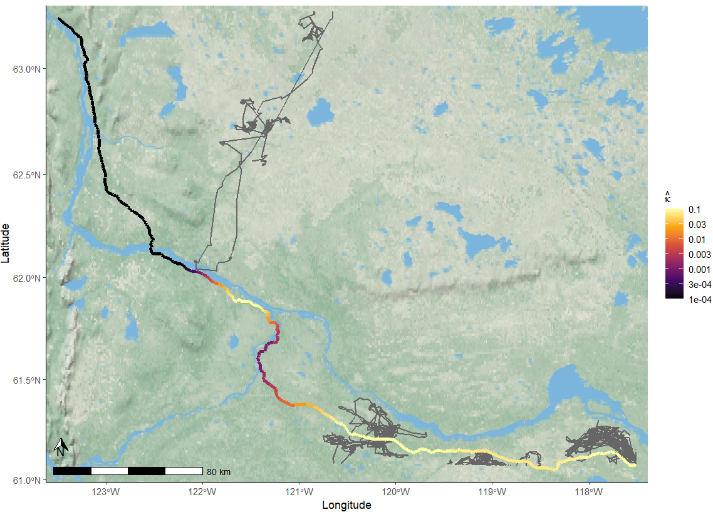

<br>

# Conclusions and Contact Information

We present a simple and fast approach for estimating permeability of linear barriers for large biotelemetry tracking datasets. Our approach provides similar flexibility to other statistical model packages and functions. Users can fit either univariate or multivariate models and can perform model selection to estimate barrier permeability, with the option to explore covariates specific to either the movement steps of the animal or the barrier. 

This tool especially serves as a useful method for quantifying permeability with respect to a barrier itself, with broad applications for management of taxa interacting with anthropogenic infrastructure (or even natural features, such as rivers). 

If you use our package in publications, please be sure to cite it as:

*Note: will be available upon publication on CRAN*

```{r eval = FALSE}
citation("permeability")
```


Report any issues or bugs to the package developers:

(Anonymous)

# Acknowledgements

*Boreal caribou tracking data used in this vignette was provided by the GNWT and made possible by the support of Indigenous Government Organizations and management authorities for boreal caribou, including the Sambaa K’e Dene Band, Fort Simpson Métis Local, Łı́ı́dlıı Kų́ę́ Kue First Nation, Tthets'ék'ehdélı First Nation, Pehdzeh Ki First Nation, Nahɂą Dehé Dene Band, Acho Dene Koe Band, Ka’a’gee Tu First Nation, Deninu K’ue First Nation, NWT Metis Nation, Hay River Métis Council, Fort Resolution Métis Council, K’atlodeeche First Nation, West Point First Nation, Deh Gáh Got'ıę First Nation, and Fort Providence Métis Council.*


